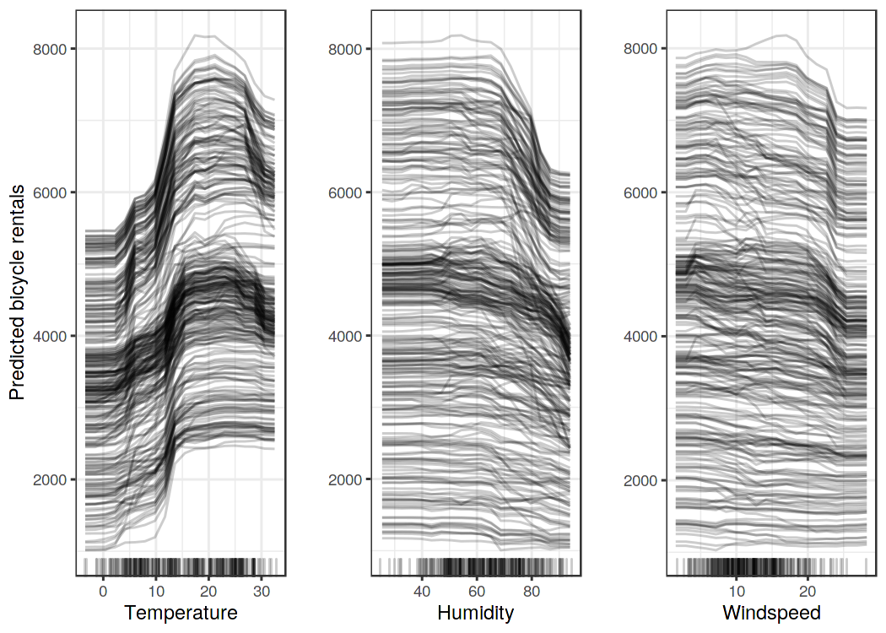
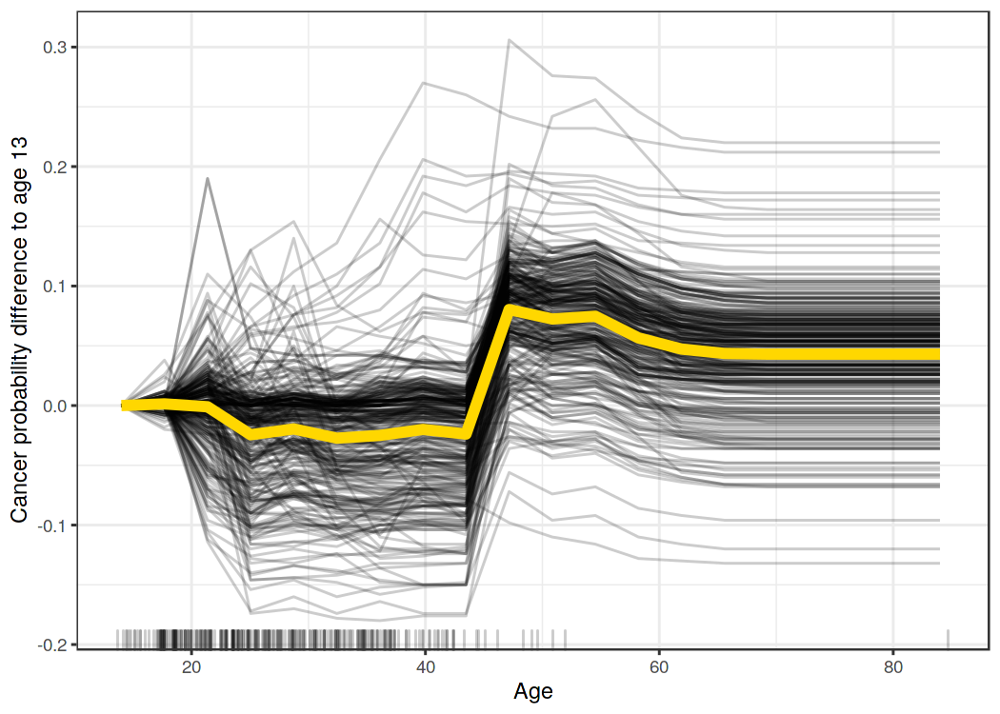
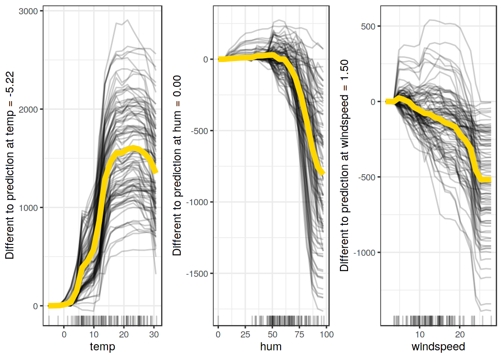

{pagebreak}

## Individual Conditional Expectation (ICE) {#ice}

Individual Conditional Expectation (ICE) plots display one line per instance that shows how the instance's prediction changes when a feature changes. 

The partial dependence plot for the average effect of a feature is a global method because it does not focus on specific instances, but on an overall average.
The equivalent to a PDP for individual data instances is called individual conditional expectation (ICE) plot (Goldstein et al. 2017[^Goldstein2017]).
An ICE plot visualizes the dependence of the prediction on a feature for *each* instance separately, resulting in one line per instance, compared to one line overall in partial dependence plots.
A PDP is the average of the lines of an ICE plot.
The values for a line (and one instance) can be computed by keeping all other features the same, creating variants of this instance by replacing the feature's value with values from a grid and making predictions with the black box model for these newly created instances.
The result is a set of points for an instance with the feature value from the grid and the respective predictions.

What is the point of looking at individual expectations instead of partial dependencies?
Partial dependence plots can obscure a heterogeneous relationship created by interactions.
PDPs can show you what the average relationship between a feature and the prediction looks like.
This only works well if the interactions between the features for which the PDP is calculated and the other features are weak.
In case of interactions, the ICE plot will provide much more insight.

A more formal definition:
In ICE plots, for each instance in $\{(x_{S}^{(i)},x_{C}^{(i)})\}_{i=1}^N$ the curve $\hat{f}_S^{(i)}$ is plotted against $x^{(i)}_{S}$, while $x^{(i)}_{C}$ remains  fixed.

### Examples

Let's go back to the [cervical cancer dataset](#cervical) and see how the prediction of each instance is associated with the feature "Age".
We will analyze a random forest that predicts the probability of cancer for a woman given risk factors.
In the [partial dependence plot](#pdp) we have seen that the cancer probability increases around the age of 50, but is this true for every woman in the dataset?
The ICE plot reveals that for most women the age effect follows the average pattern of an increase at age 50, but there are some exceptions:
For the few women that have a high predicted probability at a young age, the predicted cancer probability does not change much with age.

The next figure shows ICE plots for the [bike rental prediction](#bike-data).
The underlying prediction model is a random forest.

All curves seem to follow the same course, so there are no obvious interactions.
That means that the PDP is already a good summary of the relationships between the displayed features and the predicted number of bicycles

#### Centered ICE Plot

There is a problem with ICE plots:
Sometimes it can be hard to tell whether the ICE curves differ between individuals because they start at different predictions.
A simple solution is to center the curves at a certain point in the feature and  display only the difference in the prediction to this point.
The resulting plot is called centered ICE plot (c-ICE).
Anchoring the curves at the lower end of the feature is a good choice.
The new curves are defined as:

{$$}\hat{f}_{cent}^{(i)}=\hat{f}^{(i)}-\mathbf{1}\hat{f}(x^{a},x^{(i)}_{C}){/$$}

where $\mathbf{1}$ is a vector of 1's with the appropriate number of dimensions (usually one or two), $\hat{f}$ is the fitted model and x^a^ is the anchor point.

#### Example

For example, take the cervical cancer ICE plot for age and center the lines on the youngest observed age:

The centered ICE plots make it easier to compare the curves of individual instances.
This can be useful if we do not want to see the absolute change of a predicted value, but the difference in the prediction compared to a fixed point of the feature range.

Let's have a look at centered ICE plots for the bicycle rental prediction:

#### Derivative ICE Plot

Another way to make it visually easier to spot heterogeneity is to look at the individual derivatives of the prediction function with respect to a feature.
The resulting plot is called the derivative ICE plot (d-ICE).
The derivatives of a function (or curve) tell you whether changes occur and in which direction they occur.
With the derivative ICE plot, it is easy to spot ranges of feature values where the black box predictions change for (at least some) instances.
If there is no interaction between the analyzed feature $x_S$ and the other features $x_C$, then the prediction function can be expressed as:

{$$}\hat{f}(x)=\hat{f}(x_S,x_C)=g(x_S)+h(x_C),\quad\text{with}\quad\frac{\delta\hat{f}(x)}{\delta{}x_S}=g'(x_S){/$$}

Without interactions, the individual partial derivatives should be the same for all instances.
If they differ, it is due to interactions and it becomes visible in the d-ICE plot.
In addition to displaying the individual curves for the derivative of the prediction function with respect to the feature in S, showing the standard deviation of the derivative helps to highlight regions in feature in S with heterogeneity in the estimated derivatives.
The derivative ICE plot takes a long time to compute and is rather impractical.

### Advantages

Individual conditional expectation curves are **even more intuitive to understand** than partial dependence plots.
One line represents the predictions for one instance if we vary the feature of interest. 

Unlike partial dependence plots, ICE curves can **uncover heterogeneous relationships**.

### Disadvantages 

ICE curves **can only display one feature** meaningfully, because two features would require the drawing of several overlaying surfaces and you would not see anything in the plot.

ICE curves suffer from the same problem as PDPs: 
If the feature of interest is correlated with the other features, then **some points in the lines might be invalid data points** according to the joint feature distribution. 

If many ICE curves are drawn, the **plot can become overcrowded** and you will not see anything. 
The solution: Either add some transparency to the lines or draw only a sample of the lines.

In ICE plots it might not be easy to **see the average**. 
This has a simple solution:
Combine individual conditional expectation curves with the partial dependence plot.

### Software and Alternatives

ICE plots are implemented in the R packages `iml` (used for these examples), `ICEbox`[^ICEbox], and `pdp`.
Another R package that does something very similar to ICE is `condvis`. In Python, partial dependence plots are built into scikit-learn starting with version 0.24.0.

[^ICEbox]: Goldstein, Alex, et al. "Package ‘ICEbox’." (2017).

[^Goldstein2017]: Goldstein, Alex, et al. "Peeking inside the black box: Visualizing statistical learning with plots of individual conditional expectation." Journal of Computational and Graphical Statistics 24.1 (2015): 44-65.

